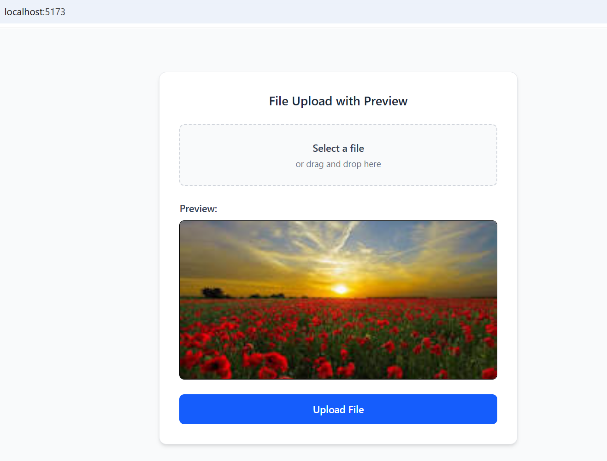
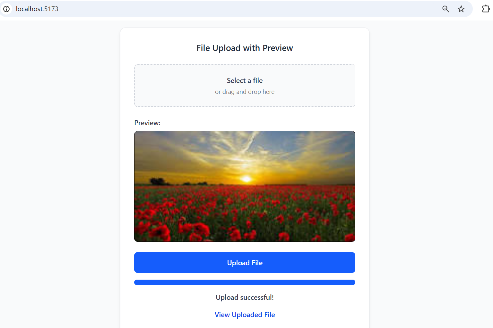

# 📤 React + Django File Upload (Cloudinary)


A minimal, beginner-friendly full-stack micro-demo showing how to upload an image to **Cloudinary** using a **Django REST API** and preview it on a **React (Vite + Tailwind)** frontend.

This version focuses strictly on the **core upload + preview logic**, keeping everything simple, clean, and minimal.

---

## ⭐ Features

- Upload an image from the frontend  
- Show instant **local preview** before upload  
- Upload file to **Django API**  
- Store image on **Cloudinary**  
- Return uploaded image URL in API response  
- Simple, clean UI (Tailwind minimal mode)

---

## 🛠 Tech Stack

**Frontend:**  
- React (Vite)  
- TypeScript  
- Tailwind CSS v4

**Backend:**  
- Python  
- Django REST Framework  
- Cloudinary Python SDK

---

## 📁 Folder Structure

```
react-django-file-upload-preview/
│
├── backend/
│   ├── fileupload/
│   ├── uploads/
│   ├── manage.py
│   └── requirements.txt
│
└── frontend/
    ├── src/
    │   ├── App.tsx
    │   ├── components/
    │   │   └── FileUpload.tsx
    │   └── index.css
    ├── vite.config.ts
    └── package.json
```

---

# 🖥 Backend Setup (Django + Cloudinary)

### 1️⃣ Install dependencies
```
pip install -r requirements.txt
```

### 2️⃣ Add Cloudinary config (settings.py)
```python
CLOUDINARY_CLOUD_NAME = os.getenv("CLOUDINARY_CLOUD_NAME")
CLOUDINARY_API_KEY = os.getenv("CLOUDINARY_API_KEY")
CLOUDINARY_API_SECRET = os.getenv("CLOUDINARY_API_SECRET")

```

### 3️⃣ Run migrations
```
python manage.py migrate
```

### 4️⃣ Start backend server
```
python manage.py runserver
```

Backend runs at:  
👉 **http://127.0.0.1:8000**

---

# 🎨 Frontend Setup (React + Vite + Tailwind)

### 1️⃣ Install dependencies
```
npm install
```

### 2️⃣ Start frontend dev server
```
npm run dev
```

Frontend runs at:  
👉 **http://localhost:5173**

---

# 🔗 API Endpoint

### **POST /api/upload/**  
Uploads an image file.

#### **Request (multipart/form-data)**
```
file: <image>
```

#### **Example Success Response**
```json
{
  "message": "Upload successful",
  "image_url": "https://res.cloudinary.com/.../sample.jpg"
}
```

---

# 🖼 Screenshots (Placeholders)

```



```

---

# 🎁 Key Features Included

✔ Minimal Django API  
✔ Cloudinary upload logic  
✔ Simple React file input  
✔ Local preview  
✔ Lightweight Tailwind UI  
✔ Fully working end-to-end example  

---
## 👨‍💻 Author

Made with ❤️ by **Ranjeet Singh**  
GitHub: https://github.com/ranjeet-singh

---

# 📄 License
Free to use for learning and portfolio purposes.
